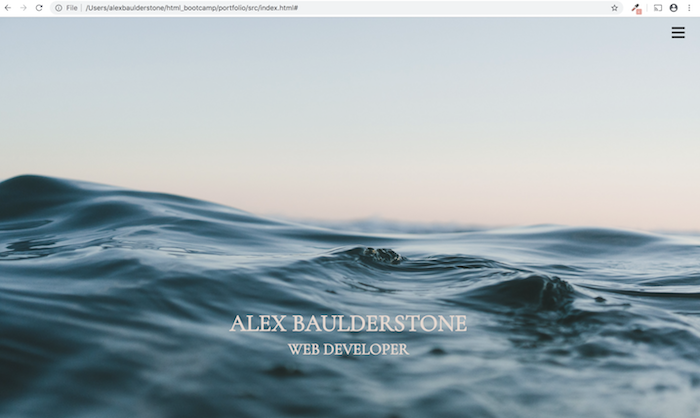
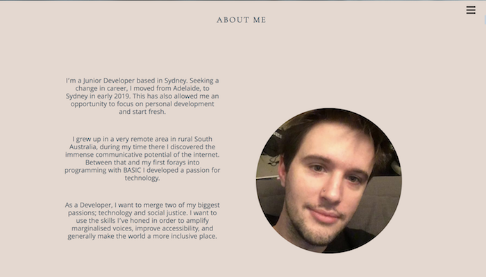
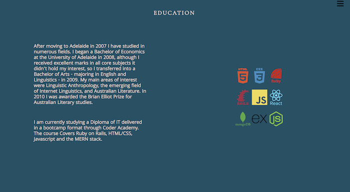
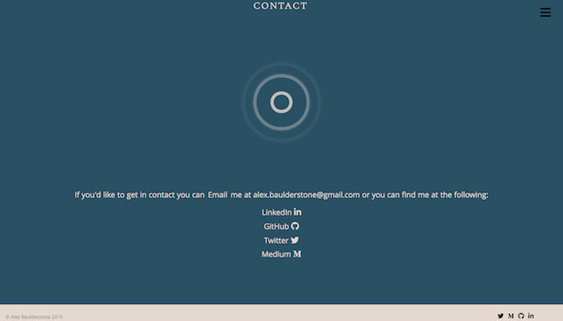
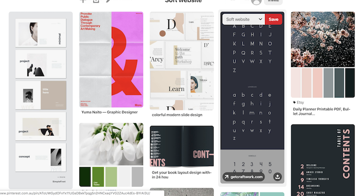
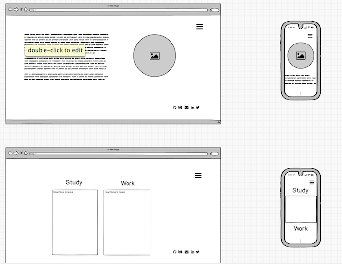
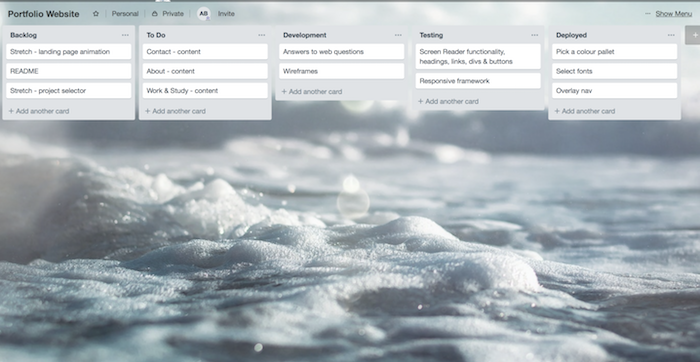
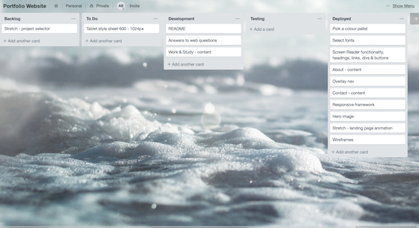

# Alex Baulderstone's Portfolio

## A link (URL) to your published portfolio website

https://abaulderstone.github.io/

## A link to your GitHub repository 

https://github.com/abaulderstone/portfolio

## Description of portfolio
    
### Purpose

The primary purpose of this site is to be used as a resume and showcase of the projects I am currently working on. It's also been an excericise in implimenting project management, version control, and HTML/CSS skills 

### Functionality 

The site has a minimal, but functional layout; It's a single scrollable page split into labled sections. A drop-down, overlay navigation is always accessable in the top right corner. A single page portfolio is easier to navigate on mobile or tablet, and also works well with a screen reader. 

This design meets the main critea of the breif: it shows my name and contact details, it links to my github, it has about me page which details my personality, and it details my work and study history. 

  
## Screenshots

 
 
 
 
 

    

## Target audience

    The target audience of the website will be internship partners, and staff at Coder Academy, although hopefully other people will enjoy it. 

### Tech stack

        -HTML
        -JavaScript
        -CSS (using SASS and flexbox)

## Design

### Design process

The first step in designing for me was looking at various portfolio websites, such as https://www.awwwards.com/websites/portfolio/ etc. 

After that I created a moodboard on pintrest. Mainly looking at colour pallets and typograohy https://www.pinterest.com.au/alexbaulderstone/soft-website/

 "Pintrest Screenshot
    
I then moved onto wireframes with Balsamiq:

I then set up a Trello to break up the work of the website into "sprints" 
 

    

### Usability considerations:

### Challenges
My biggest challenge was styling the navigation. I initially wanted the overlay only on mobile but I think I backed myself into a corner with the way I implimented it and it made it very difficult to change to a traditional navbar on the desktop version of the site. 
I also struggled with media queires, especially for tablet. It took a lot of refactoring my CSS to make sure that specificity wasn't overwriting the media rules I set up. 

I also spent an inordate amount of time working on trying to get the typewriter animation to only trigger when it entered the viewport and unfortunately had to give up on that. 

### Future improvements
I'd love to fix up the aforementioned challenges: the Navbar and the typewriter animation. I'd also like to add a whole section with projects I've been working on but I felt the cooking for two terminal app would be pretty lonely by itself on a page. 

## Short Answer Q&A

1. Describe key events in the development of the internet from the 1980s to today (max. 150 words):

1950s - 1960s: The concept of wide area networking is established in early computer science labratories. US Department of Defence develops ARPANET.

1970s: Various packet switching networks are developed using a variety of communication protocols but no formal standard is set yet.

1980s: US Department of Defense declared TCP/IP as the standard for all military computer networking. IMB et al adopt this standard and it slowly becomes the de facto communication protocol. The first ISPs are formed 

1990s: - U.S. Congress passed the Scientific and Advanced-Technology Act, Tim Berners-Lee Develops HTML, CERN releases WWW to the public. 

2000s - The concept of Web 2.0 -  websites that emphasize user-generated content (including user-to-user interaction), usability, and interoperability -  and responsive design emerge. Google becomes the dominant search engine. Myspace, Facebook and Youtube are launched. 

2. Define and describes the relationship between fundamental aspects of the internet such as: domains, web servers, DNS, and web browsers (max. 150 words):

A domain is essentially a linked group of computers, that are networked together under a centeral authority. In the context of the internet these computers are web servers. A web server stores all the component files of a website (html, css, etc) and "hosts" them to be accessed by the user. These servers can be located by their IP address, each computer connected to the internet has a unique IP address. A Domain Name Server acts as a registery of each domain name (website) and translates them into their respective IP addresses. This IP address can be accessed by a web browser - a piece of software that interprets the various components of a website, such as HTML. 

3. Reflect on one aspect of the development of internet technologies and how it has contributed to the world today (max. 150 words)

One of the most fundamental shifts in modern soceity has been the development of websites hinged on user generated content. Youtube is the biggest repository of knowledge in history and it is virtually ubiquitious. It's possible to find the answer to almost any problem by picking up a pocket sized device which can access a video walkthrough in seconds. Furthermore social networks such as Facebook allow us to instantaneously share news, photos, and thoughts with friends and family across the world. Instagram is used to curate a concept of a person's identity through the concent they choose to share with the world. This level of instant feedback has shaped the way we experience the world around us.
